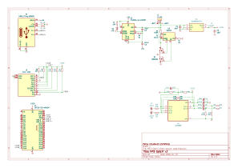

# v0.0.1 - Starting over (7.7.2026)
_Time spent: 6h 28m_

Today I decided to restart the hardware side of MP3 Gotchi instead of continuing with the first prototype approach.

The first version helped me understand the idea, but it also showed its limits. Using dev modules made the design bigger than it needed to be, limited the part choices, and hid too many things behind small black boxes. For a project that could be expanded by the community, that felt like the wrong direction.

So I started planning v2 as a proper single-board device. The main goals are to keep it small, cheap and battery-friendly, while also making the audio side much better. I want the output to work well with 24 ohm in-ear monitors, so the amplifier, DAC path, power supply and connector choices need to be picked more carefully than in the first version.

Most of today was spent researching and deciding the core hardware direction: 
USB-C for power and programming, Li-Ion power, microSD storage, and a proper external audio path instead of relying on random modules.

